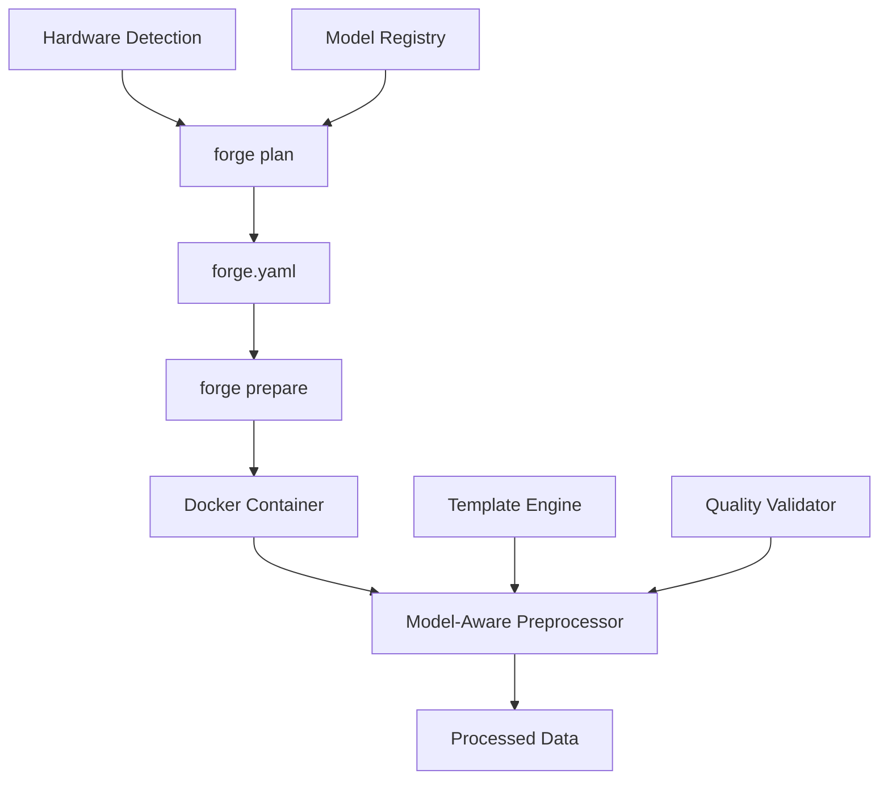

# Model-Aware Preprocessing Pipeline - Design Document

## Architecture Overview

The model-aware preprocessing pipeline transforms Forge's data preparation workflow into an intelligent, hardware-optimized system that adapts preprocessing based on the target model and available hardware resources.

### Core Components



## Component Design

### 1. Configuration Management

#### 1.1 Plan Configuration Schema
```python
@dataclass
class ForgeConfig:
    model: ModelConfig
    hardware: HardwareConfig
    preprocessing: PreprocessingConfig
    
@dataclass
class ModelConfig:
    name: str
    architecture: str
    chat_template: str
    max_length: int
    special_tokens: Dict[str, str]
    
@dataclass
class HardwareConfig:
    gpu_arch: str
    vram_gb: float
    compute_capability: float
    recommended_batch_size: int
    use_gpu_preprocessing: bool
    
@dataclass
class PreprocessingConfig:
    train_split: float
    validation_split: float
    chunk_size: int
    quality_checks: bool
    streaming_threshold_gb: float
```

#### 1.2 Configuration Persistence
- Store configuration in `forge.yaml` using YAML format
- Validate configuration schema on load
- Support configuration merging and overrides
- Provide configuration migration for version updates

### 2. Model-Aware Template System

#### 2.1 Template Registry
```python
class ChatTemplateRegistry:
    TEMPLATES = {
        "chatml": "<|im_start|>user\n{query}<|im_end|>\n<|im_start|>assistant\n{response}<|im_end|>",
        "llama": "<s>[INST] {query} [/INST] {response} </s>",
        "alpaca": "### Instruction:\n{query}\n\n### Response:\n{response}",
        "gemma": "<start_of_turn>user\n{query}<end_of_turn>\n<start_of_turn>model\n{response}<end_of_turn>",
        "vicuna": "USER: {query}\nASSISTANT: {response}",
    }
    
    @classmethod
    def get_template(cls, model_name: str) -> str:
        # Map model names to templates
        # Support custom templates
        pass
    
    @classmethod
    def validate_template(cls, template: str, sample_data: Dict) -> bool:
        # Validate template can be applied to sample data
        pass
```

#### 2.2 Model Detection
```python
class ModelDetector:
    MODEL_MAPPINGS = {
        "microsoft/DialoGPT": "chatml",
        "meta-llama/Llama": "llama", 
        "google/gemma": "gemma",
        "lmsys/vicuna": "vicuna",
        "tatsu-lab/alpaca": "alpaca",
    }
    
    def detect_template(self, model_name: str) -> str:
        # Fuzzy matching for model names
        # Return appropriate template
        pass
```

### 3. Docker-Based Preprocessing Engine

#### 3.1 Container Management
```python
class DockerPreprocessor:
    def __init__(self, config: ForgeConfig):
        self.config = config
        self.container_name = f"forge:{config.hardware.gpu_arch}"
    
    def execute_preprocessing(self, script: str, data_path: Path) -> bool:
        # Mount data directories
        # Execute preprocessing script in container
        # Stream output to host
        # Handle errors and cleanup
        pass
    
    def prepare_container(self) -> None:
        # Ensure container exists
        # Mount necessary volumes
        # Set environment variables
        pass
```

#### 3.2 Script Generation Enhancement
```python
class ModelAwareScriptGenerator:
    def __init__(self, config: ForgeConfig):
        self.config = config
        self.template_engine = ChatTemplateRegistry()
    
    def generate_script(self, metadata: Dict, analysis: str) -> str:
        # Generate preprocessing script with model-specific optimizations
        # Include hardware-aware memory management
        # Apply appropriate chat template
        pass
    
    def get_preprocessing_prompt(self) -> str:
        # Enhanced prompt with model and hardware context
        pass
```

### 4. Data Quality and Validation System

#### 4.1 Quality Validator
```python
class DataQualityValidator:
    def __init__(self, config: PreprocessingConfig):
        self.config = config
    
    def validate_input(self, data_path: Path) -> QualityReport:
        # Check for missing values, duplicates
        # Analyze text quality metrics
        # Detect encoding issues
        pass
    
    def validate_output(self, output_path: Path) -> ValidationReport:
        # Verify JSONL format
        # Check template application
        # Validate sample quality
        pass
```

#### 4.2 Advanced Splitting
```python
class AdvancedSplitter:
    def __init__(self, config: PreprocessingConfig):
        self.config = config
    
    def stratified_split(self, data: pd.DataFrame) -> Tuple[pd.DataFrame, pd.DataFrame]:
        # Implement stratified splitting
        # Support custom stratification columns
        # Maintain distribution balance
        pass
    
    def temporal_split(self, data: pd.DataFrame, time_column: str) -> Tuple[pd.DataFrame, pd.DataFrame]:
        # Time-based splitting for temporal data
        pass
```

### 5. Memory Management and Streaming

#### 5.1 Streaming Processor
```python
class StreamingProcessor:
    def __init__(self, config: ForgeConfig):
        self.config = config
        self.chunk_size = self._calculate_chunk_size()
    
    def process_large_dataset(self, data_path: Path) -> Iterator[pd.DataFrame]:
        # Stream data in chunks
        # Apply preprocessing to each chunk
        # Yield processed chunks
        pass
    
    def _calculate_chunk_size(self) -> int:
        # Calculate optimal chunk size based on available memory
        # Consider GPU memory constraints
        pass
```

#### 5.2 Progress Tracking
```python
class ProgressTracker:
    def __init__(self, total_samples: int):
        self.total_samples = total_samples
        self.processed_samples = 0
    
    def update(self, batch_size: int) -> None:
        # Update progress
        # Calculate ETA
        # Display progress bar
        pass
    
    def save_checkpoint(self, state: Dict) -> None:
        # Save processing state for resume
        pass
```

## Integration Points

### 1. Plan Command Enhancement
```python
# forge/cli/plan_cmd.py modifications
def plan_command(goal: str, data_path: Optional[Path] = None):
    # Existing planning logic
    hardware = detect_hardware()
    model_config = select_optimal_model(goal, hardware)
    
    # New: Create comprehensive configuration
    config = ForgeConfig(
        model=model_config,
        hardware=hardware_config,
        preprocessing=preprocessing_config
    )
    
    # Save configuration
    save_config(config, "forge.yaml")
```

### 2. Prepare Command Redesign
```python
# forge/cli/prepare_cmd.py complete rewrite
def prepare_command(path: Path, **kwargs):
    # Check for existing plan
    if not Path("forge.yaml").exists():
        console.print("[red]No plan found. Run 'forge plan' first.[/]")
        raise typer.Exit(1)
    
    # Load configuration
    config = load_config("forge.yaml")
    
    # Initialize model-aware preprocessor
    preprocessor = ModelAwarePreprocessor(config)
    
    # Execute preprocessing in Docker
    success = preprocessor.process_dataset(path)
    
    if success:
        console.print("[green]Preprocessing complete![/]")
    else:
        console.print("[red]Preprocessing failed![/]")
```

## Performance Optimizations

### 1. Hardware-Aware Processing
- Dynamic batch sizing based on available VRAM
- GPU acceleration for text processing operations
- Parallel processing for CPU-bound tasks
- Memory mapping for large files

### 2. Caching Strategy
- Cache processed chunks for resume capability
- Template compilation caching
- Model metadata caching
- Configuration validation caching

### 3. Resource Management
- Monitor memory usage during processing
- Implement backpressure for streaming
- Graceful degradation on resource constraints
- Automatic cleanup of temporary files

## Error Handling and Recovery

### 1. Failure Scenarios
- Docker container failures
- Out of memory conditions
- Invalid configuration
- Network connectivity issues
- Corrupted data files

### 2. Recovery Mechanisms
- Automatic retry with exponential backoff
- Checkpoint-based resume
- Fallback to CPU processing
- Configuration auto-correction
- Graceful degradation

## Testing Strategy

### 1. Unit Tests
- Configuration validation
- Template application
- Data quality checks
- Memory management
- Docker integration

### 2. Integration Tests
- End-to-end workflow testing
- Multi-container scenarios
- Large dataset processing
- Error recovery testing

### 3. Performance Tests
- Memory usage benchmarks
- Processing speed metrics
- Scalability testing
- Resource utilization monitoring

## Correctness Properties

Based on the prework analysis, here are the key correctness properties that must be validated:

### Property 1: Configuration Consistency
**Validates: Requirements 1.1, 1.2**
```python
def test_config_consistency(plan_config, prepare_execution):
    """
    Property: The prepare command must use the exact model configuration 
    specified in the plan phase.
    """
    assert prepare_execution.model_config == plan_config.model_config
    assert prepare_execution.chat_template == plan_config.model.chat_template
```

### Property 2: Template Application Correctness
**Validates: Requirements 3.1, 3.2**
```python
def test_template_application(input_data, template, output_data):
    """
    Property: All output samples must correctly apply the specified chat template
    without data loss or corruption.
    """
    for input_sample, output_sample in zip(input_data, output_data):
        expected = template.format(**input_sample)
        assert output_sample["text"] == expected
```

### Property 3: Data Split Preservation
**Validates: Requirements 4.2**
```python
def test_split_preservation(original_data, train_data, val_data, split_ratio):
    """
    Property: Train/validation splits must maintain the specified ratio
    and preserve data distribution characteristics.
    """
    total_samples = len(train_data) + len(val_data)
    actual_train_ratio = len(train_data) / total_samples
    assert abs(actual_train_ratio - split_ratio) < 0.01
```

### Property 4: Memory Efficiency
**Validates: Requirements 4.3, 5.1**
```python
def test_memory_efficiency(dataset_size, available_memory, processing_result):
    """
    Property: Processing must complete successfully even when dataset size
    exceeds available memory through streaming.
    """
    if dataset_size > available_memory:
        assert processing_result.used_streaming == True
        assert processing_result.peak_memory < available_memory
```

### Property 5: Output Format Validation
**Validates: Requirements 4.4**
```python
def test_output_format(output_file):
    """
    Property: All output files must be valid JSONL format with required fields.
    """
    for line in output_file:
        sample = json.loads(line)
        assert "text" in sample
        assert isinstance(sample["text"], str)
        assert len(sample["text"]) > 0
```

### Property 6: Docker Container Consistency
**Validates: Requirements 2.1, 2.2**
```python
def test_container_consistency(hardware_config, selected_container):
    """
    Property: The selected Docker container must match the detected
    hardware architecture.
    """
    expected_container = get_container_for_arch(hardware_config.gpu_arch)
    assert selected_container == expected_container
```

## Security Considerations

### 1. Container Security
- Run containers with minimal privileges
- Isolate container filesystem
- Validate mounted volumes
- Secure API key handling

### 2. Script Validation
- Enhanced security analysis for generated scripts
- Sandboxed execution environment
- Resource usage limits
- Network access restrictions

## Deployment Strategy

### 1. Backward Compatibility
- Support legacy workflow during transition
- Configuration migration utilities
- Deprecation warnings for old commands
- Gradual feature rollout

### 2. Feature Flags
- Enable/disable Docker preprocessing
- Toggle advanced features
- Performance optimization flags
- Debug mode controls

## Monitoring and Observability

### 1. Metrics Collection
- Processing time and throughput
- Memory and GPU utilization
- Error rates and types
- User workflow patterns

### 2. Logging Strategy
- Structured logging for debugging
- Performance metrics logging
- Error tracking and reporting
- User action analytics

## Future Enhancements

### 1. Advanced Features
- Multi-modal data support (images, audio)
- Distributed preprocessing across multiple GPUs
- Real-time preprocessing monitoring dashboard
- Integration with MLOps platforms

### 2. Optimization Opportunities
- Custom CUDA kernels for text processing
- Advanced caching strategies
- Predictive resource allocation
- Automated hyperparameter tuning