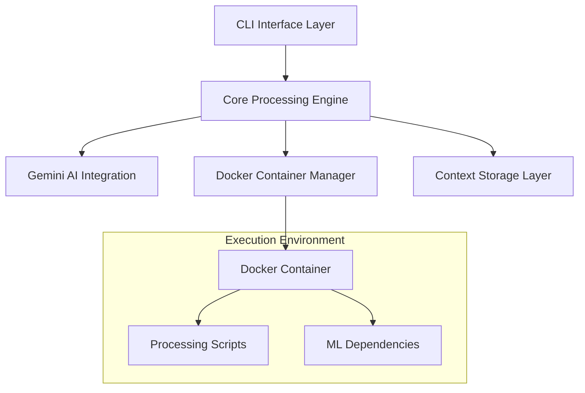

# Design Document: Gemini Data Processor

## Overview

The Gemini Data Processor is a command-line tool that leverages Google's Gemini AI to intelligently analyze and process datasets through modular script execution in isolated Docker containers. The system emphasizes human oversight, minimal local dependencies, and adaptive processing based on data insights.

The architecture follows a modular approach where the CLI orchestrates the workflow, Gemini AI provides intelligence for data analysis and script generation, and Docker containers provide isolated execution environments. The system maintains context between operations and requires explicit user approval for all operations.

## Architecture

The system follows a layered architecture with clear separation of concerns:



### Key Architectural Principles

1. **Isolation**: All data processing occurs in Docker containers, keeping the local environment clean
2. **Human-in-the-Loop**: Every operation requires explicit user approval
3. **Modularity**: Processing is broken into small, focused scripts rather than monolithic operations
4. **Context Awareness**: The system maintains processing history to inform subsequent operations
5. **Adaptive Processing**: Scripts are generated and modified based on data insights

## Components and Interfaces

### Component Factory and Dependency Injection

**Purpose**: Provides centralized component creation and dependency management with proper lifecycle handling.

**Key Components**:
- `ComponentFactory`: Creates and configures all system components with proper dependencies
- `DependencyContainer`: Manages component lifecycle and dependency resolution
- `ConfigurationLoader`: Loads and validates configuration from multiple sources

**Interfaces**:
```python
class ComponentFactory:
    def create_cli_interface(self, config: CLIConfig) -> CLIInterface
    def create_processing_engine(self, config: CLIConfig) -> ProcessingEngine
    def create_gemini_integration(self, config: GeminiConfig) -> GeminiIntegration
    def create_docker_manager(self, config: ResourceConfig) -> DockerManager
    def create_context_storage(self, project_dir: str) -> ContextStorage
    def cleanup_all_components(self) -> None

class DependencyContainer:
    def register_singleton(self, interface_type: Type, implementation: Any) -> None
    def register_transient(self, interface_type: Type, factory: Callable) -> None
    def resolve(self, interface_type: Type) -> Any
    def dispose(self) -> None  # Cleanup all managed resources
```

### CLI Interface Layer

**Purpose**: Provides the primary user interface and orchestrates the overall workflow.

**Key Components**:
- `ArgumentParser`: Handles command-line argument parsing using Python's argparse
- `ProgressDisplay`: Shows progress indicators and status updates
- `UserInteraction`: Manages user approval workflows and input collection
- `OutputManager`: Handles result presentation and file organization

**Interfaces**:
```python
class CLIInterface:
    def parse_arguments(self, args: List[str]) -> CLIConfig
    def display_progress(self, message: str, percentage: float) -> None
    def request_user_approval(self, operation: str, details: str) -> bool
    def display_results(self, results: ProcessingResults) -> None
```

### Core Processing Engine

**Purpose**: Coordinates the data processing workflow and manages component interactions.

**Key Components**:
- `WorkflowOrchestrator`: Manages the overall processing pipeline and handles crash recovery
- `DataAnalyzer`: Handles initial data structure analysis and snapshot creation with data sanitization
- `ScriptCoordinator`: Manages script generation, validation, and execution sequencing with syntax checking
- `ConfigurationManager`: Handles API keys, settings, and environment configuration
- `SessionManager`: Manages processing session lifecycle, cleanup, and recovery
- `SecurityManager`: Handles API key cleanup and secure memory management

**Interfaces**:
```python
class ProcessingEngine:
    def initialize_session(self, input_file: str, config: CLIConfig) -> ProcessingSession
    def analyze_data_structure(self, session: ProcessingSession) -> DataAnalysis
    def execute_processing_pipeline(self, session: ProcessingSession) -> ProcessingResults
    def cleanup_session(self, session: ProcessingSession) -> None
    def recover_abandoned_session(self, session_id: str) -> Optional[ProcessingSession]

class ScriptCoordinator:
    def validate_script_syntax(self, script: ProcessingScript) -> ValidationResult
    def handle_validation_failure(self, script: ProcessingScript, errors: List[str]) -> ProcessingScript
    def generate_script_sequence(self, analysis: DataAnalysis) -> List[ProcessingScript]

class SessionManager:
    def create_session(self, input_file: str) -> str  # Returns session_id with timestamp
    def get_active_sessions(self) -> List[ProcessingSession]
    def cleanup_abandoned_sessions(self, max_age_hours: int) -> None
    def is_session_recoverable(self, session_id: str) -> bool
    def cleanup_session_security(self, session_id: str) -> None  # Wipes API keys and sensitive data

class SecurityManager:
    def wipe_all_api_keys(self) -> None
    def secure_memory_cleanup(self) -> None
    def cleanup_container_secrets(self, container_id: str) -> None
    def register_cleanup_handler(self) -> None  # For abnormal termination
```

### Gemini AI Integration

**Purpose**: Provides intelligent data analysis and script generation capabilities with secure data handling.

**Key Components**:
- `GeminiClient`: Handles API communication and authentication with secure key management
- `PromptManager`: Manages prompt templates and context formatting with data sanitization
- `ResponseParser`: Processes Gemini responses and extracts actionable information
- `RateLimiter`: Manages API usage limits and implements backoff strategies
- `DataSanitizer`: Removes sensitive information from data before API transmission
- `APIKeyManager`: Handles secure API key lifecycle with automatic cleanup

**Interfaces**:
```python
class GeminiIntegration:
    def authenticate(self, api_key: str) -> bool:
        """
        Raises:
            InvalidAPIKeyError: When key format is invalid
            NetworkError: When unable to reach Gemini API
            RateLimitError: When rate limit exceeded
        """
    
    def analyze_data_snapshot(self, snapshot: DataSnapshot) -> DataAnalysis:
        """
        Raises:
            DataSanitizationError: When sensitive data cannot be safely removed
            APIQuotaExceededError: When API quota is exhausted
        """
    
    def generate_processing_script(self, analysis: DataAnalysis, context: ProcessingContext) -> ProcessingScript:
        """
        Raises:
            ScriptGenerationError: When AI cannot generate valid script
            ContextTooLargeError: When context exceeds API limits
        """

class DataSanitizer:
    def sanitize_snapshot(self, snapshot: DataSnapshot) -> DataSnapshot
    def detect_sensitive_data(self, data: Dict[str, Any]) -> List[str]
    def mask_sensitive_fields(self, data: Dict[str, Any], fields: List[str]) -> Dict[str, Any]

class APIKeyManager:
    def load_api_key(self) -> str
    def store_api_key_securely(self, key: str) -> None
    def wipe_api_key_from_memory(self) -> None
    def secure_overwrite_memory(self, memory_location: str) -> None
    def cleanup_all_api_keys(self) -> None  # Called on session end/failure
```

### Docker Container Manager

**Purpose**: Manages isolated execution environments for data processing scripts with security and resource controls.

**Key Components**:
- `ContainerOrchestrator`: Creates, manages, and destroys Docker containers with resource limits
- `ImageManager`: Handles base image selection and customization
- `VolumeManager`: Manages data volume mounting and file system isolation with proper permissions
- `PackageInstaller`: Handles dynamic package installation within containers
- `SecurityManager`: Enforces container security policies and non-root execution

**Resource Limits**:
- CPU: 2 cores maximum per container
- Memory: 4GB maximum per container  
- Disk: 10GB maximum per container
- Network: Isolated from host network by default

**Interfaces**:
```python
class DockerManager:
    def create_processing_container(self, requirements: List[str]) -> Container:
        """
        Raises:
            DockerNotAvailableError: When Docker daemon is not running
            ResourceLimitError: When system resources are insufficient
            ImagePullError: When base image cannot be downloaded
        """
    
    def execute_script(self, container: Container, script: ProcessingScript) -> ExecutionResult:
        """
        Raises:
            ScriptExecutionError: When script fails to execute
            ContainerTimeoutError: When execution exceeds timeout
            ResourceExhaustionError: When container runs out of resources
        """
    
    def install_packages(self, container: Container, packages: List[str]) -> bool:
        """
        Raises:
            PackageInstallationError: When package installation fails
            NetworkError: When package repositories are unreachable
        """
    
    def cleanup_container(self, container: Container) -> None
    def force_cleanup_all_containers(self) -> None  # For crash recovery

class SecurityManager:
    def configure_non_root_user(self, container: Container) -> None
    def set_volume_permissions(self, volume_path: str, read_only: bool) -> None
    def validate_container_isolation(self, container: Container) -> bool

class VolumeManager:
    def mount_input_volume(self, container: Container, input_file: str) -> str  # Returns mount path
    def mount_output_volume(self, container: Container, output_dir: str) -> str
    def create_working_directory(self, container: Container) -> str
```

### Context Storage Layer

**Purpose**: Maintains processing history and intermediate results for context-aware operations with transaction support.

**Key Components**:
- `SQLiteStorage`: Persistent storage using SQLite database with WAL mode for concurrency
- `SessionManager`: Manages processing sessions and their lifecycle with automatic cleanup
- `ResultsArchiver`: Handles intermediate result storage and retrieval with compression
- `ContextBuilder`: Constructs context for Gemini AI from historical data
- `TransactionManager`: Provides ACID transactions for consistent state management

**File System Layout**:
```
project_directory/
├── .gemini-processor/
│   ├── context.db          # SQLite database
│   ├── sessions/
│   │   ├── {session_id}/
│   │   │   ├── input/      # Read-only input files
│   │   │   ├── output/     # Generated output files
│   │   │   ├── intermediate/ # Script outputs
│   │   │   └── logs/       # Execution logs
│   └── temp/               # Temporary files
└── output/                 # Final results (user-specified)
    └── {timestamp}_results/
        ├── processed_data.csv
        ├── processing_summary.json
        └── execution_log.txt
```

**Interfaces**:
```python
class ContextStorage:
    def create_session(self, input_file: str) -> str:  # Returns session_id with timestamp
        """
        Raises:
            StorageLimitError: When storage exceeds 100MB limit
            FileSystemError: When unable to create session directory
        """
    
    def store_analysis(self, session_id: str, analysis: DataAnalysis) -> None:
        """
        Raises:
            SessionNotFoundError: When session_id is invalid
            TransactionError: When database transaction fails
        """
    
    def store_script_result(self, session_id: str, script: ProcessingScript, result: ExecutionResult) -> None
    def get_processing_context(self, session_id: str) -> ProcessingContext
    def cleanup_old_sessions(self, max_age_days: int) -> None
    def get_storage_usage(self) -> StorageStats
    def create_checkpoint(self, session_id: str) -> str  # Returns checkpoint_id
    def restore_from_checkpoint(self, checkpoint_id: str) -> ProcessingSession

class TransactionManager:
    def begin_transaction(self) -> TransactionContext
    def commit_transaction(self, context: TransactionContext) -> None
    def rollback_transaction(self, context: TransactionContext) -> None
    def is_transaction_active(self) -> bool
```

## Data Models

### Core Data Structures

```python
@dataclass
class DataSnapshot:
    """Represents a sample of the input data for analysis"""
    rows: List[Dict[str, Any]]
    schema: Dict[str, str]  # column_name -> data_type
    file_format: str
    total_rows: int
    sample_size: int
    sanitized_fields: List[str]  # Fields that were sanitized
    extraction_method: str  # 'random', 'first_n', 'stratified'

@dataclass
class DataAnalysis:
    """Results of Gemini AI analysis of the data snapshot"""
    data_quality_issues: List[str]
    suggested_operations: List[str]
    column_insights: Dict[str, str]
    processing_recommendations: List[str]
    estimated_complexity: str
    sensitive_data_detected: bool
    recommended_security_level: str

@dataclass
class ProcessingScript:
    """Represents a generated script for data processing"""
    script_id: str
    content: str
    description: str
    required_packages: List[str]
    input_files: List[str]
    output_files: List[str]
    estimated_runtime: int
    validation_status: ValidationStatus
    security_level: str  # 'safe', 'caution', 'restricted'

@dataclass
class ExecutionResult:
    """Results from script execution in Docker container"""
    success: bool
    output_data: Optional[str]
    error_message: Optional[str]
    execution_time: float
    output_files: List[str]
    logs: str
    resource_usage: ResourceUsage
    container_id: str

@dataclass
class ProcessingSession:
    """Represents a complete data processing session"""
    session_id: str  # Format: {timestamp}_{hash}
    input_file: str
    output_directory: str
    created_at: datetime
    last_accessed: datetime
    data_snapshot: DataSnapshot
    scripts_executed: List[ProcessingScript]
    current_context: ProcessingContext
    status: SessionStatus  # 'active', 'completed', 'failed', 'abandoned'
    checkpoints: List[str]  # List of checkpoint IDs

@dataclass
class ValidationResult:
    """Results from script syntax validation"""
    is_valid: bool
    syntax_errors: List[str]
    security_warnings: List[str]
    suggested_fixes: List[str]
    validation_time: float

@dataclass
class ResourceUsage:
    """Container resource usage statistics"""
    cpu_percent: float
    memory_mb: float
    disk_mb: float
    network_bytes: int
    execution_time: float

@dataclass
class StorageStats:
    """Context storage usage statistics"""
    total_size_mb: float
    session_count: int
    oldest_session_date: datetime
    available_space_mb: float
```

### Configuration Models

```python
@dataclass
class CLIConfig:
    """Configuration from command-line arguments"""
    input_file: str
    output_directory: Optional[str]
    verbose: bool
    quiet: bool
    max_file_size_gb: float
    docker_timeout: int
    enable_progress_indicators: bool
    concurrent_containers: int  # Default: 1

@dataclass
class GeminiConfig:
    """Configuration for Gemini AI integration"""
    api_key: str
    model_name: str
    max_tokens: int
    temperature: float
    rate_limit_requests_per_minute: int
    enable_data_sanitization: bool
    max_context_size: int

@dataclass
class SecurityConfig:
    """Security configuration for the system"""
    enable_container_isolation: bool
    run_containers_as_non_root: bool
    enable_network_isolation: bool
    sanitize_sensitive_data: bool
    max_api_key_age_days: int

@dataclass
class ResourceConfig:
    """Resource limits and configuration"""
    max_container_memory_gb: int
    max_container_cpu_cores: int
    max_container_disk_gb: int
    max_execution_time_minutes: int
    max_concurrent_containers: int

# Enums for type safety
class SessionStatus(Enum):
    ACTIVE = "active"
    COMPLETED = "completed"
    FAILED = "failed"
    ABANDONED = "abandoned"

class ValidationStatus(Enum):
    VALID = "valid"
    INVALID = "invalid"
    WARNING = "warning"
    PENDING = "pending"

class FileFormat(Enum):
    CSV = "csv"
    JSON = "json"
    TEXT = "text"
    UNKNOWN = "unknown"
```

## Correctness Properties

*A property is a characteristic or behavior that should hold true across all valid executions of a system—essentially, a formal statement about what the system should do. Properties serve as the bridge between human-readable specifications and machine-verifiable correctness guarantees.*

### Property 1: Supported File Format Parsing
*For any* valid CSV, JSON, or text file provided as input, the CLI tool should successfully parse and process it without errors.
**Validates: Requirements 1.1, 1.2, 1.3**

### Property 2: Unsupported Format Error Handling
*For any* file with an unsupported format, the CLI tool should return an error message that specifically lists the supported formats (CSV, JSON, TXT).
**Validates: Requirements 1.4**

### Property 3: Data Snapshot Size Consistency
*For any* dataset with 100 or more rows, the data snapshot should contain exactly 100 randomly selected rows. For datasets with fewer than 100 rows, the snapshot should contain all available rows.
**Validates: Requirements 2.1, 2.4**

### Property 4: Analysis Results Persistence
*For any* completed data analysis or script execution, the results should be stored in the context storage system and be retrievable for future operations.
**Validates: Requirements 2.5, 3.4**

### Property 5: User Approval Requirement
*For any* script execution or package installation operation, the system should require explicit user approval before proceeding with the operation.
**Validates: Requirements 4.1, 4.2**

### Property 6: Approval Denial Handling
*For any* operation where user approval is denied, the system should skip that operation and continue with the remaining workflow without terminating.
**Validates: Requirements 4.3**

### Property 7: Complete Information Display
*For any* generated script, the system should display both the complete script content and a plain-language description of its purpose to the user.
**Validates: Requirements 4.4**

### Property 8: Docker Isolation Enforcement
*For any* script execution or package installation, the operation should occur exclusively within a Docker container and never in the host system's Python environment.
**Validates: Requirements 5.1, 5.2, 5.4, 5.5**

### Property 9: Minimal Local Dependencies
*For any* installation of the CLI tool, the local virtual environment should contain only the minimal dependencies required for CLI operation, with no machine learning or data processing libraries.
**Validates: Requirements 5.3**

### Property 10: Sequential Script Execution
*For any* series of processing scripts, they should execute in the correct order with each script having access to the outputs of previously executed scripts.
**Validates: Requirements 3.5**

### Property 11: API Key Validation
*For any* attempt to use Gemini AI functionality, the system should validate that a proper API key is configured before making any API calls.
**Validates: Requirements 12.1**

### Property 12: Rate Limiting Compliance
*For any* sequence of API calls to Gemini, the system should enforce rate limiting to stay within API usage limits and implement exponential backoff when limits are exceeded.
**Validates: Requirements 12.3, 12.4**

### Property 13: Secure API Key Storage
*For any* API key configuration, the key should be stored using secure methods (system keyring or environment variables) and never in plain text files.
**Validates: Requirements 12.5**

### Property 14: SQLite Storage Implementation
*For any* context storage operation, the system should use a SQLite database located within the project directory for persistence.
**Validates: Requirements 15.1, 15.5**

### Property 15: Storage Size Management
*For any* project's context storage, the system should enforce a 100MB size limit and automatically remove the oldest entries when this limit is exceeded.
**Validates: Requirements 15.2, 15.3**

### Property 16: Output File Naming Consistency
*For any* processing session, output files should follow a consistent naming pattern with timestamps and descriptive names indicating the processing step performed.
**Validates: Requirements 14.3**

### Property 17: Context Storage Portability
*For any* project directory, the context storage should be completely self-contained within the project directory and portable across different systems.
**Validates: Requirements 15.5**

### Property 18: Progress Indicator Accuracy
*For any* long-running operation exceeding 30 seconds, the system should display progress indicators that accurately reflect the current processing status.
**Validates: Requirements 10.3**

### Property 19: Script Validation Enforcement
*For any* user-modified script, the system should validate syntax and security before execution, and provide specific error messages for validation failures.
**Validates: Requirements 4.5**

### Property 20: Container Resource Isolation
*For any* script execution, the Docker container should enforce resource limits (CPU, memory, disk) and prevent access to host system resources beyond mounted volumes.
**Validates: Requirements 5.5**

### Property 21: API Key Security Cleanup
*For any* processing session completion, termination, or failure, the system should automatically wipe all API keys from memory and ensure no API keys remain in container memory or temporary files.
**Validates: Requirements 16.1, 16.2, 16.3, 16.4, 16.5**

## Error Handling

The system implements comprehensive error handling across all components to ensure graceful degradation and clear user feedback.

### Error Categories and Handling Strategies

**File System Errors**:
- Invalid file paths: Display specific error with file path validation
- Permission issues: Check and display required permissions with resolution commands
- File format errors: Validate format early and provide supported format list
- Large file handling: Warn users about files exceeding 1GB limit and request confirmation

**Docker Environment Errors**:
- Docker not installed: Display installation instructions and exit gracefully
- Docker daemon not running: Provide specific commands to start Docker service
- Container creation failures: Log detailed error information and suggest troubleshooting steps
- Package installation failures: Retry with alternative packages and provide manual installation guidance

**API Integration Errors**:
- Invalid API keys: Display clear error messages with steps to obtain valid keys
- Rate limiting: Implement exponential backoff with user-visible retry indicators
- Network connectivity: Detect network issues and provide offline mode suggestions
- Service unavailability: Display service status and estimated recovery times when available

**Data Processing Errors**:
- Script execution failures: Capture complete error tracebacks and suggest fixes
- Memory limitations: Monitor container resource usage and provide optimization suggestions
- Data corruption: Validate data integrity at each processing step
- Context storage errors: Implement automatic recovery and backup mechanisms

### Error Recovery Mechanisms

**Automatic Recovery**:
- Retry failed API calls with exponential backoff
- Automatically clean up failed Docker containers
- Recover from temporary file system issues
- Restore context from backup when primary storage fails

**User-Guided Recovery**:
- Provide specific troubleshooting steps for each error type
- Allow users to retry failed operations after addressing issues
- Offer alternative processing approaches when primary methods fail
- Enable manual intervention points in the processing pipeline

## Testing Strategy

The testing strategy employs a dual approach combining unit tests for specific scenarios and property-based tests for comprehensive coverage of the correctness properties.

### Unit Testing Approach

**Component-Level Testing**:
- Test individual components in isolation with mocked dependencies
- Focus on specific examples, edge cases, and error conditions
- Validate integration points between components
- Test configuration loading and validation logic

**Key Unit Test Areas**:
- File format detection and parsing with various file types
- CLI argument parsing with different command combinations
- Docker container lifecycle management
- Context storage CRUD operations
- API key validation and secure storage
- Error message formatting and user interaction flows

### Property-Based Testing Configuration

**Testing Framework**: Use Hypothesis for Python property-based testing with minimum 100 iterations per property test.

**Property Test Implementation**:
- Each correctness property maps to exactly one property-based test
- Tests generate random valid inputs to verify universal properties
- All property tests tagged with format: **Feature: gemini-data-processor, Property {number}: {property_text}**
- Property tests focus on invariants that must hold across all valid inputs

**Special Property Test Considerations**:
- **Property 10 (Sequential Execution)**: Uses stateful testing with generated script sequences and dependency tracking
- **Property 8 (Docker Isolation)**: Combines property testing with integration tests to verify container isolation
- **Property 20 (Resource Isolation)**: Uses resource monitoring during property test execution to verify limits

**Test Data Generation**:
- Generate random CSV, JSON, and text files with various structures
- Create files with different sizes (small, medium, large, oversized)
- Generate various API key formats (valid, invalid, expired)
- Create different Docker environment states for testing
- Generate script sequences with valid dependencies for stateful testing

**Property Test Examples**:
```python
@given(valid_csv_file())
def test_csv_parsing_property(csv_file):
    """Feature: gemini-data-processor, Property 1: Supported File Format Parsing"""
    result = cli_tool.parse_file(csv_file)
    assert result.success == True
    assert result.data_snapshot is not None

@given(unsupported_file_format())
def test_unsupported_format_error(file_path):
    """Feature: gemini-data-processor, Property 2: Unsupported Format Error Handling"""
    result = cli_tool.parse_file(file_path)
    assert result.success == False
    assert "CSV, JSON, TXT" in result.error_message

@given(script_sequence_with_dependencies())
def test_sequential_execution_property(script_sequence):
    """Feature: gemini-data-processor, Property 10: Sequential Script Execution"""
    session = create_test_session()
    results = []
    for script in script_sequence:
        result = execute_script_in_session(session, script)
        results.append(result)
        # Verify each script can access outputs from previous scripts
        if len(results) > 1:
            assert script_has_access_to_previous_outputs(script, results[:-1])

@given(container_resource_test_scenario())
def test_container_isolation_property(scenario):
    """Feature: gemini-data-processor, Property 20: Container Resource Isolation"""
    container = create_test_container(scenario.resource_limits)
    result = execute_resource_intensive_script(container, scenario.script)
    
    # Verify resource limits are enforced
    assert result.resource_usage.memory_mb <= scenario.resource_limits.max_memory_mb
    assert result.resource_usage.cpu_percent <= scenario.resource_limits.max_cpu_percent
    
    # Verify host system isolation
    assert not script_accessed_host_filesystem(result)
    assert not script_accessed_host_network(result)
```

### Integration Testing

**End-to-End Workflow Testing**:
- Test complete data processing workflows with real Docker containers
- Validate context persistence across multiple processing sessions
- Test user approval workflows with simulated user interactions
- Verify output file generation and organization

**Docker Integration Testing**:
- Test container creation, script execution, and cleanup
- Validate package installation within containers
- Test volume mounting and file system isolation
- Verify container resource limits and cleanup

### Performance and Load Testing

**Performance Benchmarks**:
- Data snapshot extraction should complete within 30 seconds for supported file sizes
- Context storage operations should complete within 1 second
- Docker container startup should complete within 10 seconds
- API calls should respect rate limits and implement proper backoff

**Load Testing Scenarios**:
- Process files approaching the 1GB size limit
- Execute multiple scripts in sequence with large datasets
- Test context storage with maximum allowed data (100MB)
- Validate system behavior under API rate limiting conditions

### Test Environment Setup

**Local Development Testing**:
- Use Docker-in-Docker for testing container operations
- Mock Gemini AI responses for consistent testing
- Use temporary directories for file system testing
- Implement test data cleanup after each test run

**Continuous Integration Testing**:
- Run all unit tests and property tests on every commit
- Execute integration tests on pull requests
- Perform performance regression testing on releases
- Validate Docker compatibility across different environments